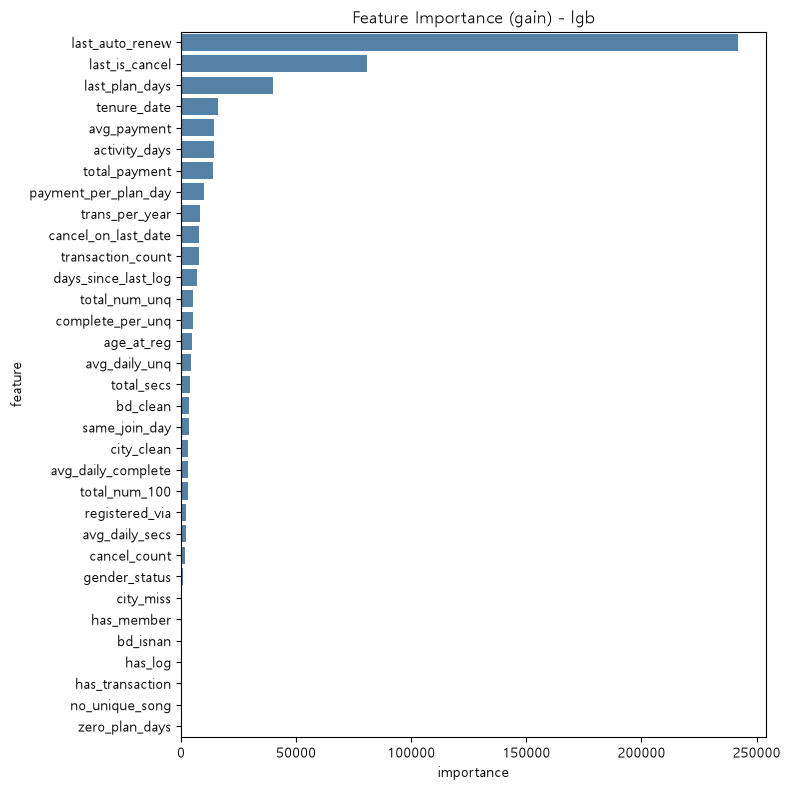
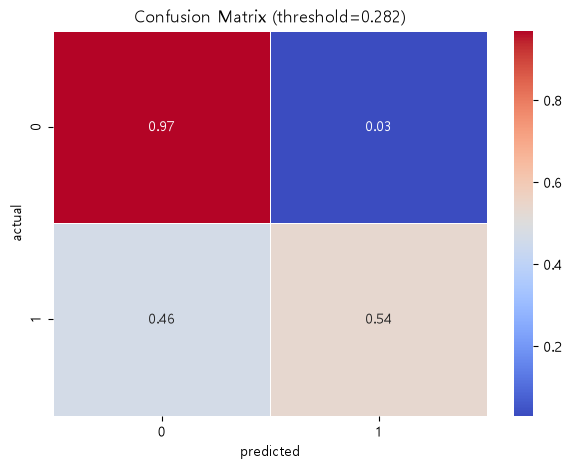
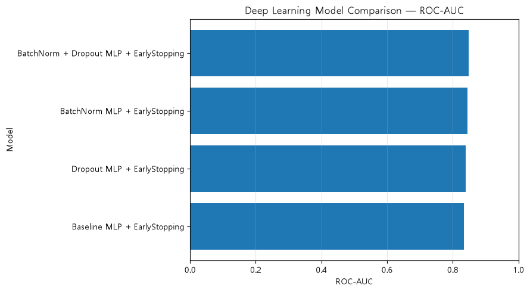
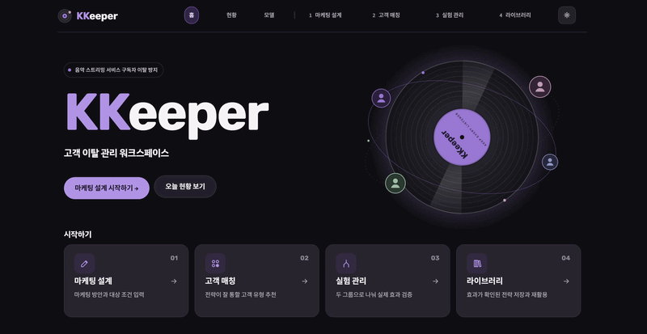
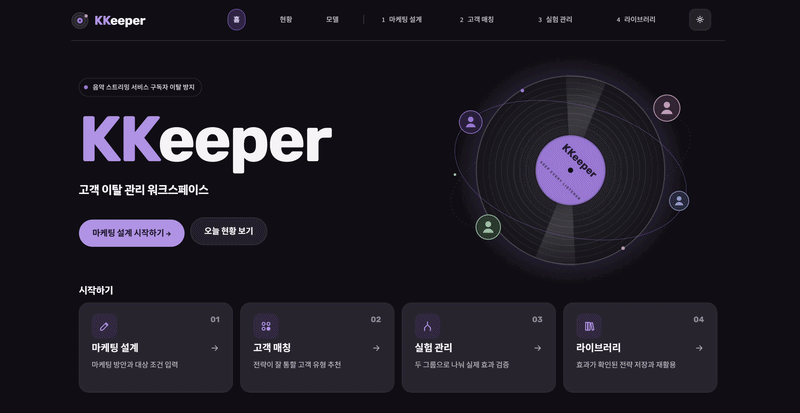
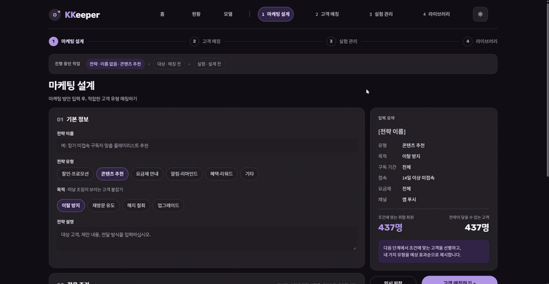

# 🎧 KKeeper
### KKBox 고객 이탈 예측 및 리텐션 전략 지원 서비스

## 프로젝트 소개

음악 스트리밍 플랫폼 **KKBox** 유료 회원의 청취·결제 행동 데이터를 기반으로 고객 이탈을 예측하고, 고객 유형화·SHAP 분석·마케팅 전략 실험을 연결해 데이터 기반 리텐션 의사결정을 지원하는 서비스형 프로젝트입니다.

---

## 팀원 소개

전체 팀원이 EDA·Feature Engineering·머신러닝·딥러닝 베이스라인을 공통으로 수행하고, 이후 단계는 아래와 같이 역할을 나눠 진행했습니다.

<table>
  <tr>
    <td align="center"></td>
    <td align="center"></td>
    <td align="center"></td>
    <td align="center"></td>
  </tr>
  <tr>
    <td align="center"><b>소희</b></td>
    <td align="center"><b>희영</b></td>
    <td align="center"><b>용우</b></td>
    <td align="center"><b>선아</b></td>
  </tr>
  <tr>
    <td align="center">데이터 전처리 · UI</td>
    <td align="center">EDA · 피처 엔지니어링</td>
    <td align="center">머신러닝</td>
    <td align="center">딥러닝</td>
  </tr>
</table>

### 역할 분담

| 담당 | 역할 | 주요 업무 | 주요 산출물 |
| --- | --- | --- | --- |
| **소희** | 데이터 전처리 및 UI | 데이터 구조 확인, 테이블 병합, 결측치·이상치 처리, 학습 데이터 생성, 회원정보 EDA, 최종 모델 연동, 전체 일정·문서 관리, 웹서비스 UI 구현 | 전처리 결과서, 통합 학습 데이터, 모델 연동 코드, 최종 문서, 최종 모델, 웹서비스 |
| **희영** | EDA·피처 엔지니어링 총괄 | 공통 EDA 기준 수립, 결제·구독정보 EDA, 결제 피처 생성, 팀원별 EDA·피처 취합, 중복 피처 정리, 최종 피처 목록 관리 | EDA 결과, 데이터·피처 정의서, 통합 피처 데이터 |
| **용우** | 머신러닝 | 사용자 로그 EDA, 이용 행동 피처 생성, 데이터 분할, 베이스라인 구축, Logistic Regression·Random Forest·LightGBM·CatBoost 등 모델 비교, 성능 평가 및 모델 저장 | 머신러닝 성능 비교, 학습 결과, ML 모델, 예측 코드 |
| **선아** | 딥러닝 | 이용 변화량 EDA, 종합 행동 피처 생성, MLP 모델 설계·학습, 성능 평가, 머신러닝 모델과 성능 비교, 딥러닝 모델 저장 | 딥러닝 학습 결과, ML·DL 비교표, DL 모델, 추론 코드 |

---

## 프로젝트 개요

### 배경
- 구독 경제 모델에서는 신규 고객 유치 비용이 기존 고객 유지 비용보다 훨씬 높아, 이탈 방지가 곧 비용 절감으로 이어집니다.
- 수백만 명 규모의 청취·결제 로그를 사람이 직접 분석해 이탈 징후를 찾는 것은 현실적으로 불가능해, 머신러닝 기반 자동화된 이탈 예측이 필요합니다.

### 목적
1. **이탈 위험 고객 조기 식별**: 청취 패턴·결제 이력을 기반으로 이탈 가능성이 높은 고객을 선제적으로 분류
2. **이탈 핵심 요인 파악**: 어떤 요인이 이탈에 가장 큰 영향을 미치는지 데이터로 확인
3. **고객 유형별 맞춤 대응**: 이탈 위험 고객을 유형화해, 유형별로 다른 이탈 요인에 맞는 대응 전략 연결

---

## 기술 스택

| 분류 | 사용 기술 |
| --- | --- |
| 언어 | Python |
| 데이터 처리 | pandas, numpy |
| 머신러닝 | scikit-learn, LightGBM, XGBoost, CatBoost, Optuna |
| 딥러닝 | PyTorch |
| 모델 해석 | SHAP |
| 웹 서비스 | Streamlit |
| 데이터베이스 | SQLite(기본) / MySQL(선택) |
| 패키지 관리 | uv |
| 협업 도구 | Git/GitHub, Notion, Discord, Google Drive |

---

## 데이터

- **출처**: [Kaggle WSDM - KKBox's Churn Prediction Challenge](https://www.kaggle.com/c/kkbox-churn-prediction-challenge)
- **Target 정의**: 구독 만료 후 30일 이내 재구독하지 않으면 이탈(`is_churn=1`)

### 최종 데이터셋 (`integrated_data.csv`)
- Kaggle 원본 6개 파일(`train_v2`, `members_v3`, `transactions`, `transactions_v2`, `user_logs`, `user_logs_v2`)을 내려받아 활용
- `train_v2`(전체 97만 명)를 기준으로 `is_churn` 비율을 유지한 채 10만 명을 추출하고, 2017-02-28 기준으로 그 이후 기록·가입 고객을 제외해 `members`·`transactions`·`user_logs`를 각각 10만 명 규모로 샘플링
- 실제 통합 데이터는 `train_v2`를 기준으로 회원 정보(`members_v3`), 거래 정보(`transactions` 계열 집계), 청취 로그(`user_logs` 계열 집계)를 `msno` 기준으로 결합해 생성
- `notebooks/01_eda/05_integrated_eda.ipynb` 에서 최종 `integrated_data.csv` 생성
- 최종 100,000명 × 22컬럼, 이탈 비율 9.0% / 유지 비율 91.0% (원본 전체 비율과 동일)

### 데이터 사전

| 분류 | 컬럼명 | 설명 |
| --- | --- | --- |
| 식별자 | `msno` | 사용자 고유 ID |
| 타깃 | `is_churn` | 이탈 여부: 1(이탈) / 0(유지) |
| 회원 정보 | `city`, `bd`, `gender`, `registered_via`, `registration_init_time` | 거주 도시, 나이, 성별, 가입 경로, 최초 가입일 |
| 결제 정보 | `transaction_count`, `cancel_count`, `total_payment` | 총 결제 횟수, 취소 횟수, 총 결제액 |
| | `last_auto_renew`, `last_is_cancel`, `last_plan_days`, `cancel_on_last_date` | 마지막 거래 기준 자동갱신·취소·플랜 일수 상태 |
| | `days_to_expire` | 마지막 거래 만료일 − 기준일 (모델 피처에서는 제외, 자세한 내용은 `notebooks/02_machine_learning` 참고) |
| 활동 정보 | `activity_days`, `total_secs`, `total_num_100`, `total_num_unq`, `days_since_last_log` | 활동일 수, 총 청취 시간, 완청 횟수, 고유 곡 수, 마지막 청취 후 경과일 |
| | `has_transaction`, `has_log` | 거래·로그 기록 존재 여부 |

---

## 폴더 구조

```text
SKN36-2nd-1Team/
├── app/                           # Streamlit 서비스
│   ├── .streamlit/
│   │   └── config.toml
│   ├── assets/fonts/
│   │   └── NanumGothic.ttf        # PDF 보고서용 한글 폰트
│   ├── common/
│   │   ├── constants.py           # 위험 기준선(0.2824), 고객 유형, 선택지 상수
│   │   ├── data.py                # 데이터·모델 로딩
│   │   ├── db.py                  # SQLite/MySQL 실험 저장소
│   │   ├── experiment.py          # What-if·A/B 테스트 로직
│   │   └── report.py              # 실험 결과 PDF 보고서 생성
│   ├── pages/
│   │   ├── 1_dashboard.py         # 현황 대시보드
│   │   ├── 2_marketing.py         # ① 마케팅 설계
│   │   ├── 3_matching.py          # ② 고객 매칭
│   │   ├── 4_experiments.py       # ③ 실험 관리
│   │   ├── 5_library.py           # ④ 전략 라이브러리
│   │   └── 6_model.py             # 모델 성능·SHAP
│   ├── app.py                     # 메인 페이지
│   └── ui.py                      # 공통 UI
├── data/
│   ├── raw/                       # Kaggle 원본 데이터 (Git 미추적)
│   ├── sampled/                   # 표본 데이터 (Git 미추적)
│   ├── processed/
│   │   └── integrated_data.csv    # 100,000명 × 22컬럼 통합 데이터
│   └── kkeeper.db                 # 앱 실행 시 생성되는 SQLite DB (Git 미추적)
├── database/
│   ├── docker-compose.yml
│   └── init/01_schema.sql         # MySQL 실험 저장소 스키마
├── docs/                          # 프로젝트 산출물 및 README 리소스
│   ├── 1. 요구사항정의서_v3.xlsx
│   ├── 2. 데이터 및 피처 정의서_v3.1.xlsx
│   ├── 3. 데이터 전처리 결과서_v2.2.xlsx
│   ├── 4. 모델별 실험·성능 비교표_v2.pdf
│   ├── 5. 모델 학습 결과서_v1.3.xlsx
│   ├── 6. 2차 단위프로젝트 발표자료_최종.pdf
│   └── assets/
│       ├── 소희.jpg / 용우.jpg / 희영.jpg / 선아.jpg
│       ├── ml_feature_importance.png
│       ├── ml_confusion_matrix.png
│       ├── dl_auc_comparison.png
│       ├── main.gif
│       ├── dashboard_model.gif
│       └── marketing_flow.gif
├── models/
│   └── final_model_lgb.pkl        # 최종 LightGBM 모델 (Git 미추적)
├── notebooks/
│   ├── 00_sample_customer_selection.ipynb
│   ├── 01_eda/                    # 회원·거래·로그·타깃·통합 EDA
│   ├── 02_machine_learning/       # 팀원별 ML + 최종 비교
│   ├── 03_deep_learning/          # 팀원별 DL + 최종 비교
│   ├── 04_experiment/             # 마케팅 효과 시뮬레이션
│   ├── 05_final_model/            # 최종 모델 학습·저장
│   ├── 06_customer_clustering/    # 이탈 위험 고객 유형화
│   ├── 07_SHAP/                   # SHAP 분석
│   └── common/                    # 모델링 공통 유틸
├── .gitignore
├── pyproject.toml
└── uv.lock
```

> `database/mysql_data/`, `__pycache__/` 등 실행 중 생성되는 파일은 실제 개발 환경에는 존재할 수 있지만 저장소 관리 대상이 아니므로 위 구조에서는 제외했습니다.

---

## 실행 방법

```bash
# 1. 환경 설치
uv sync

# 2. 노트북 실행 순서 (일부 중간 산출물과 모델 파일은 필요 시 아래 순서로 재생성할 수 있습니다)
# notebooks/00_sample_customer_selection.ipynb  → 표본 생성
# notebooks/01_eda/                              → EDA → integrated_data.csv
# notebooks/02_machine_learning/                 → ML 베이스라인 비교
# notebooks/03_deep_learning/                     → DL 베이스라인 비교
# notebooks/05_final_model/01_final_model.ipynb   → 최종 모델 학습·저장 (models/final_model_lgb.pkl, data/processed/kkbox_scored.csv, test_predictions.csv)
# notebooks/06_customer_clustering/               → 이탈 위험 고객 유형화 (risk_segments.csv, risk_segment_summary.csv)
# notebooks/07_SHAP/                              → SHAP 분석

# 3. 서비스 실행
uv run streamlit run app/app.py
```

실험 관리(A/B 테스트) 기록은 별도 설정 없이 `data/kkeeper.db`(SQLite)에 자동 저장됩니다. 여러 명이 같은 DB를 공유하고 싶다면 `database/docker-compose.yml`로 MySQL을 띄우고 `KK_DB_URL` 환경변수를 설정하면 됩니다.

---

## 모델링 결과

### 최종 모델 선정
ML 5종(Logistic/RF/XGBoost/LightGBM/CatBoost)과 DL 4종(Baseline/BatchNorm/Dropout/BatchNorm+Dropout MLP)을 비교한 결과, **ML 계열(LightGBM)이 DL 계열 전체보다 높은 성능**을 보여 최종 모델로 선정했습니다.

| 계열 | 모델 | 담당 | ROC-AUC | Recall | F1 |
| --- | --- | --- | --- | --- | --- |
| ML | **LightGBM (튜닝)** ⭐ | 공통 | **0.8719** | 0.5363 | 0.5806 |
| ML | CatBoost (튜닝) | 공통 | 0.8701 | - | - |
| ML | XGBoost | 공통 | 0.8568 | - | - |
| DL | BatchNorm + Dropout MLP | 차용우 | 0.8485 | 0.5536 | 0.5637 |
| DL | BatchNorm MLP | 장선아 | 0.8458 | 0.3849 | 0.5157 |
| DL | Dropout MLP | 박소희 | 0.8399 | 0.3777 | 0.5119 |
| DL | Baseline MLP | 문희영 | 0.8338 | 0.6592 | 0.5087 |

※ ML은 Test 기준(20,000명), DL은 모델마다 Test 또는 Validation 기준이 섞여 있어 참고용으로 함께 표기했습니다. ML 표의 Recall/F1은 F1 최적 운영 기준선(threshold=0.2824) 적용 기준입니다.

<br>
*최종 LightGBM Feature Importance (gain 기준) — last_auto_renew, last_is_cancel, last_plan_days 순*

<br>
*Confusion Matrix (threshold=0.2824 적용, Test 기준)*

<br>
*DL 4종 ROC-AUC 비교*

### 주요 이탈 요인 (SHAP 분석)
최종 LightGBM 모델의 SHAP 분석 결과, 테스트 데이터 기준 이탈에 가장 크게 기여한 변수는 다음과 같습니다.

1. `last_auto_renew` — 자동갱신 여부 (가장 영향이 큼)
2. `payment_per_plan_day` — 플랜 일수 대비 결제 효율
3. `tenure_date` — 가입 후 경과일
4. `avg_payment` — 평균 결제액
5. `total_payment` — 총 결제액

이탈 위험군으로 좁혀서 보면 `last_is_cancel`(마지막 거래 취소), `last_plan_days`(플랜 기간), `cancel_on_last_date`(마지막 거래일 취소 여부)의 영향이 더 커지는 경향을 보였습니다. 고객 유형별 SHAP 분석 결과는 `notebooks/07_SHAP/` 참고.

---

## 서비스 화면

### 메인 화면


### 현황 및 모델


### 마케팅 전략 실행 흐름

